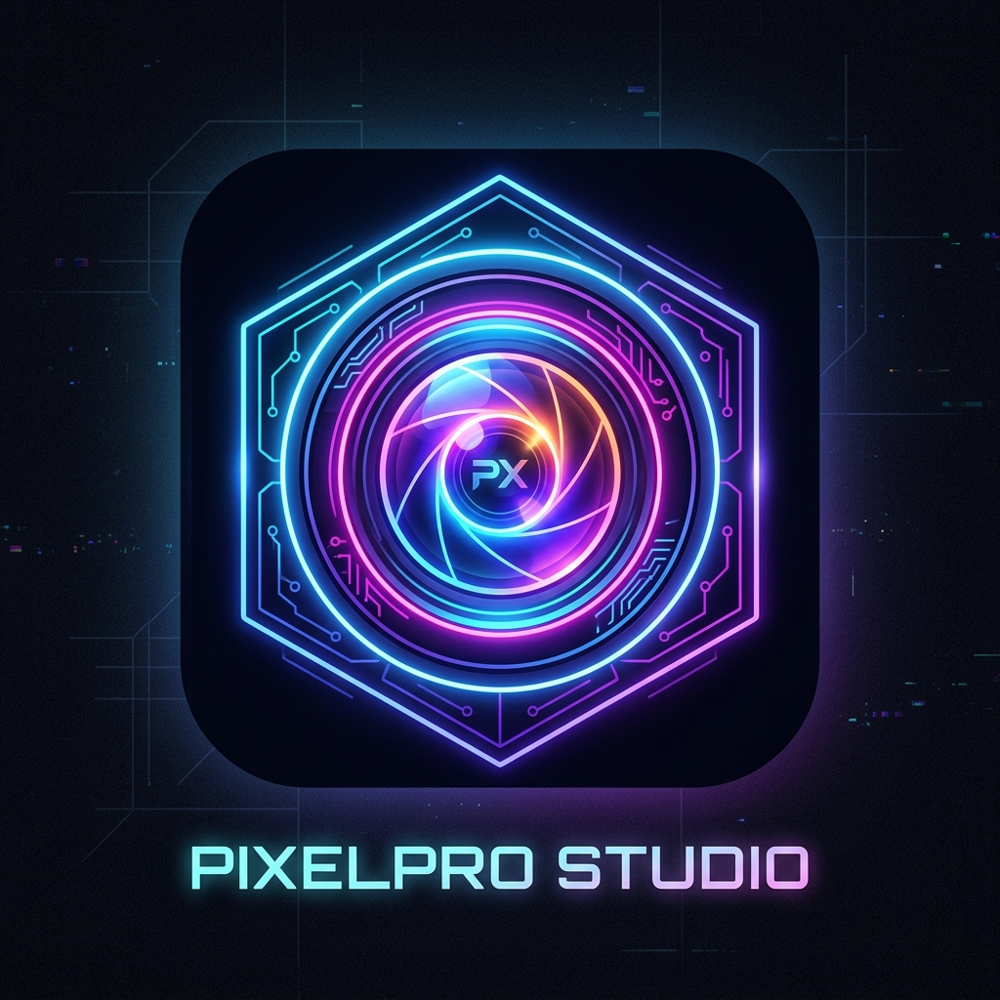

<div align="center">
  
  <h1>PixelForge V5 Ultimate</h1>
  
  <p>
    <strong>El editor fotográfico de próxima generación directo en tu navegador.</strong>
  </p>

  <p>
    
    
    
    
  </p>
</div>

---

> [!TIP]
> **Privacidad Primero:** Todas las ediciones ocurren a nivel local en tu dispositivo gracias a la aceleración de hardware de HTML5 Canvas. Ninguna imagen es enviada a servidores de terceros.

## ✨ Características Principales

PixelForge ha evolucionado a través de una rigurosa auditoría de Diseño Dirigido por Software (SDD). Sus herramientas comerciales incluyen:

- **🚀 Interfaz Drag & Drop:** Arrastra fotos desde tu escritorio y suéltalas en el lienzo sin complicaciones.
- **🎨 Filtros Paramétricos en Tiempo Real:** Ajusta Brillo, Contraste, Saturación, Tono (Hue) y Desenfoque usando sliders ultra responsivos.
- **⚡ Filtros de 1-Clic:** Cambia a Blanco y Negro o Invierte los colores al instante mediante lógica píxel por píxel.
- **🕰️ Máquina del Tiempo (Historial):** Deshace y rehace hasta 10 pasos con una memoria óptima sin sobrecargar tu RAM.
- **🔍 Control de Zoom y Rotación:** Inspecciona los mínimos detalles de alta resolución con controles de panorámica, o gira las imágenes 90 grados.
- **©️ Marca de Agua Premium:** Agrega textos personalizados con opacidad estilizada a tus proyectos antes de publicarlos.
- **🌗 Temas Dinámicos:** Cambia radicalmente la interfaz de un Neon Oscuro (*Dark Mode*) a un vibrante y minimalista estilo claro (*Light Mode*).
- **💾 Exportación Avanzada:** Exporta el Canvas directo a tu ordenador en calidades JPG, PNG, o el ultraligero WebP.

---

## 🛠️ Tecnologías Empleadas

El proyecto está orquestado bajo un ecosistema moderno:

| Tecnología | Rol en el Proyecto |
| --- | --- |
| **Vite + React** | Motor de construcción ultrarrápido y librería de componentes UI. |
| **Framer Motion** | Modales interactivos, micro-interacciones y *Floating Dock* animado. |
| **Lucide React** | Iconografía limpia y unificada para los paneles. |
| **HTML5 Canvas** | Manejo crudo del DOM para manipulación binaria y de filtros en imágenes. |
| **Vitest & RTL** | Suite de Pruebas Automatizadas (TDD) previniendo regresiones del sistema. |

---

## 🚀 Inicio Rápido (Local)

Para correr la aplicación en tu entorno local, clona este repositorio y sigue los pasos:

```bash
# 1. Instalar las dependencias
npm install

# 2. Levantar el servidor en caliente (Dev Server)
npm run dev
```

Abra el navegador en `http://localhost:5173/` para ver la aplicación funcionando.

### Construir para Producción

Para compilar el código minimizado y óptimo:
```bash
npm run build
```
Los archivos finales se encontrarán en la carpeta `/dist/`.

---

## 🧪 Pruebas Automatizadas (Tests)

El software cuenta con un conjunto de pruebas diseñadas para probar los renderizados de componentes y la estabilidad de eventos clave en React.

Para correr la suite de Vitest:
```bash
npm run test
```
*La suite cubre renderizado inicial, estados de Historial y el cambio de Tema (Dark/Light); no cubre (todavía) la carga de imágenes ni los filtros pixel a pixel.*

---

## 📚 Documentación Adicional

- ¿Eres un desarrollador? El archivo `App.jsx` cuenta con un set completo de comentarios en español usando notación `JSDoc` explicando exhaustivamente la manipulación del contexto del Canvas.
- Puedes leer el documento completo de uso para usuarios en el archivo [docs/manual_de_uso.md](./docs/manual_de_uso.md).
- La carpeta [`legacy_v1/`](./legacy_v1) conserva, sin modificar, la primera versión del proyecto (HTML/CSS/JS puro, sin build ni framework). Se mantiene como referencia histórica y no forma parte de la aplicación que corre con `npm run dev`.

---

## 📄 Licencia

Este proyecto se distribuye bajo la licencia [MIT](./LICENSE).

---
<div align="center">
  <i>Desarrollado con precisión mediante auditorías de Software Design Document (SDD).</i>
</div>
