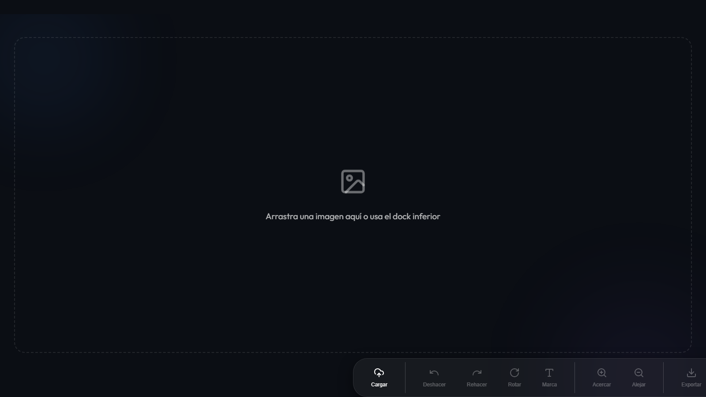
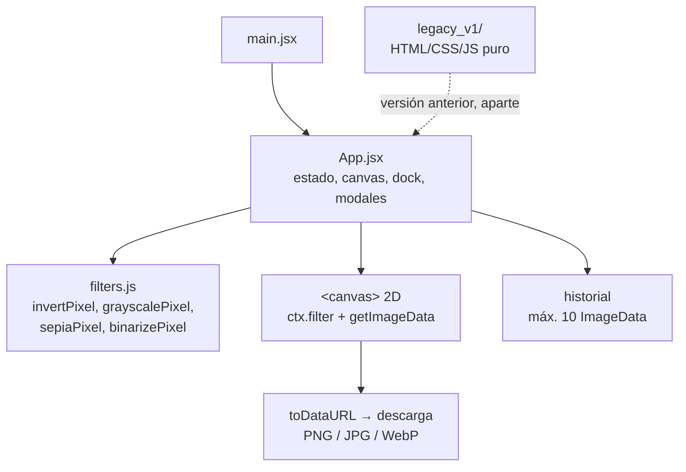

<div align="center">
  
  <h1>PixelForge</h1>
  <p><b>Editor de imágenes en el navegador con filtros en tiempo real, historial y procesamiento 100 % local.</b></p>
  
  
  
  
  
  <p>
    <a href="#-inicio-rápido">Inicio rápido</a> ·
    <a href="#-características">Características</a> ·
    <a href="#-arquitectura">Arquitectura</a> ·
    <a href="#-pruebas">Pruebas</a> ·
    <a href="#-lo-que-todavía-no-existe">Limitaciones</a>
  </p>
</div>

PixelForge es una aplicación web de una sola pantalla (React + Vite) para retocar una imagen con el `<canvas>` del navegador: ajustes paramétricos, dos filtros de un clic, rotación, zoom, marca de agua y exportación. La imagen se lee y se procesa en el navegador; el código no contiene ninguna llamada de red para enviarla. **No es** un editor por capas ni un sustituto de Photoshop: es un editor simple con un lienzo y una imagen a la vez.

## 🎬 Vista rápida

Estado inicial de la aplicación (tema oscuro), capturado desde la build de producción servida en local con Chrome headless:

<p align="center">
  
</p>


Flujo de uso: `Cargar` (o arrastrar y soltar) → ajustar sliders o filtros de un clic → `Marca` opcional → `Exportar`.

## ✨ Características

| Característica | Detalle |
|---|---|
| Carga de imagen | Botón `Cargar` o arrastrar y soltar. Rechaza archivos que no son imagen y los de más de 25 MB, con un banner de error descartable. |
| Ajustes paramétricos | Brillo, Contraste, Saturación, Tono y Desenfoque mediante filtros CSS del contexto 2D del canvas. |
| Filtros de un clic | Invertir colores y Blanco y Negro, píxel a píxel, procesados por tandas de 250 000 píxeles con indicador "Procesando". |
| Historial | Deshacer/Rehacer sobre hasta 10 estados de píxeles (se guardan al aplicar un filtro de un clic o la marca de agua). |
| Rotación y zoom | Rotación de 90° en 90°; zoom de 0,25× a 3× en pasos de 0,25. |
| Marca de agua | Texto configurable, dibujado abajo a la derecha (48 px, blanco al 50 %). |
| Exportación | PNG, JPG y WebP con nombre `pixelpro_export.<ext>`. |
| Temas | Oscuro y claro. |
| Accesibilidad básica | Modales que se cierran con Escape o clic en el fondo, foco inicial en el botón de cierre y `role="alert"` en los errores de carga. |

## 🏗️ Arquitectura



`App.jsx` concentra el estado y el dibujo; `filters.js` contiene funciones puras probadas por separado. `legacy_v1/` es la primera versión (sin build) y no forma parte de la app que arranca con `npm run dev`.

## 🚀 Inicio rápido

| Requisito | Versión |
|---|---|
| Node.js | 20 (la usada en CI; en local se verificó con Node 24) |
| npm | el incluido con Node |

```bash
git clone https://github.com/Luiss2080/PixelForge.git
cd PixelForge
npm ci
npm run dev        # servidor de desarrollo de Vite (por defecto http://localhost:5173/)
```

Otros comandos verificados: `npm run build` (genera `dist/`), `npm run preview`, `npm run lint` (oxlint, sin avisos) y `npm test`.

<details>
<summary>Estructura de carpetas</summary>

```text
src/App.jsx          # componente principal (UI, canvas, historial, modales)
src/filters.js       # funciones puras de píxel
src/*.test.*         # tests con Vitest + Testing Library
legacy_v1/           # versión inicial HTML/CSS/JS puro
docs/manual_de_uso.md# manual para usuarios
docs/assets/         # logo del README
docs/screenshots/    # capturas del README
.github/workflows/ci.yml  # lint, tests con cobertura y build (Node 20)
```

</details>

<details>
<summary>Stack</summary>

React 19, Vite 8, Framer Motion (animaciones), Lucide React (iconos), Vitest 5 + Testing Library + `vitest-canvas-mock` + jsdom, oxlint. Versiones tomadas de `package.json`.

</details>

## 🧪 Pruebas

```bash
npm test               # 29 tests en 2 archivos, todos pasan
npm run test:coverage  # con cobertura (lo que ejecuta CI)
```

- `src/filters.test.js`: funciones puras (`invertPixel`, `grayscalePixel`, `sepiaPixel`, `binarizePixel`, `applyFilterToImageData`).
- `src/App.test.jsx`: render inicial, botones deshabilitados, cambio de tema, modal de información (Escape y fondo), etiquetado del slider de Brillo, indicador de procesamiento y errores de carga (archivo no imagen, demasiado grande).

Los tests usan un canvas simulado (`vitest-canvas-mock`): no comprueban el resultado visual real de los filtros ni la exportación.

## 🔒 Seguridad

- Sin backend ni llamadas de red para las imágenes: todo se procesa en el navegador.
- Validación de tipo (`image/*`) y de tamaño (25 MB) antes de leer el archivo; manejo de errores de lectura, decodificación y de canvas "contaminado" (`getImageData`).

## 🚧 Lo que todavía no existe

- Los sliders (brillo, contraste, etc.), la rotación y el zoom no se registran en el historial.
- `sepiaPixel` y `binarizePixel` existen y están probadas, pero **no tienen botón** en la interfaz.
- Los tests no cubren la carga real de una imagen ni el resultado píxel a píxel (sí comprueban, con el canvas simulado, que exportar, la marca de agua y encadenar filtros ya no redibujan la imagen original sobre los píxeles filtrados).
- La marca de agua tiene tamaño, color, opacidad y posición fijos.
- `docs/manual_de_uso.md` menciona procesamiento con aceleración de hardware en imágenes 4K sin medición que lo respalde.
- Sin pruebas E2E.

## 📄 Licencia

[MIT](LICENSE).

<div align="center"><sub>Hecho por Luiss2080 · Edición de imágenes sin salir del navegador</sub></div>
